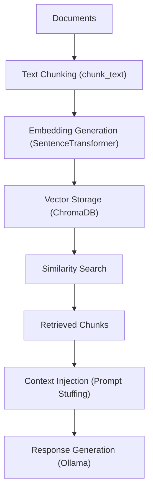

# Simple RAG for chat bot context / one source of truth.

- I can add categorized knowledge for multiple app support
- a debugger?
- can apply i guess semantic, hybrid and full text. right now its running on bullshit and imagination.

# Architecture no bullshit this time



this is a very simple vector database-backed RAG system, but it's not a vector database itself

creates a Chroma collection.
```py
chroma = chromadb.PersistentClient(path="/data/chroma")
collection = chroma.get_or_create_collection("knowledge")
```
Then during ingestion we are storing:

- chunk text
- embedding vector
- metadata

inside Chroma.

That's the vector database part.

```py
embeddings = embedder.encode(chunks).tolist()

collection.upsert(
    ids=ids,
    embeddings=embeddings,
    documents=chunks,
)
```

So the RAG this time is basically this function:

- Convert user question → embedding
- Search nearest vectors
- Return matching chunks

```py
def retrieve_context(query: str):
    q_emb = embedder.encode([query]).tolist()

    results = collection.query(
        query_embeddings=q_emb,
        n_results=min(TOP_K, collection.count())
    )

    return results["documents"][0]
```

Then once we got it we just inject it to the msg we will send to the model

```py
prompt = build_tool_prompt(
    user_msg,
    tool_results
)
```

That's it

# Installation

```bash
sudo apt-get update
sudo apt-get install zstd -y
sudo apt-get install curl wget ca-certificates -y
curl -fsSL https://ollama.com/install.sh | sh

# check version
ollama --version

# check status
sudo systemctl status ollama

# another check via curl
curl http://localhost:11434/api/tags

# download model (gemma3 4b) but up to you lol
ollama pull gemma3:4b

# model list
ollama list

# Test it!
ollama run gemma3:4b "Hello! What is your name and what can you help me with?"

# Congrats you have a low profile model running on CPU on almost 3gb ram? slow though but good trade!
```

## Quick start

```bash
# 1. Build & start
docker compose up --build -d

# 2. Check it's healthy
curl http://localhost:8330/health

# 3. Ingest your documents
curl -X POST 'http://localhost:8330/ingest' \
  --form 'files=@/D:/CLIENT FOR ASP/control-panel/documentation/faq.txt'

# 4. Chat (same format as before, just port 8330 now)
curl -X POST http://localhost:8330/v1/chat/completions \
  -H "Content-Type: application/json" \
  -H "Authorization: Bearer dummy" \
  -d '{
    "messages": [{"role": "user", "content": "How to upload?"}],
    "stream": false
  }'
```

## API endpoints

| Method | Path | Description |
|--------|------|-------------|
| GET | `/health` | Status + doc count |
| POST | `/ingest` | Upload files (PDF, TXT, MD) |
| DELETE | `/ingest` | Wipe all indexed documents |
| POST | `/v1/chat/completions` | Chat with RAG (Gemma-compatible) |
| GET | `/v1/models` | Proxied from Gemma3 |

## Environment variables

| Variable | Default | Description |
|----------|---------|-------------|
| `GEMMA_URL` | `http://host.docker.internal:8328` | Your Gemma3 address |
| `GEMMA_MODEL` | `gemma3:4b` | Model name |
| `EMBED_MODEL` | `all-MiniLM-L6-v2` | Sentence transformer model |
| `TOP_K` | `4` | Chunks to retrieve per query |
| `CHUNK_SIZE` | `400` | Words per chunk |
| `CHUNK_OVERLAP` | `60` | Overlap between chunks |

## Logs

```bash
docker compose logs -f rag
```

## Stop / wipe

```bash
docker compose down          # stop, keep vector data
docker compose down -v       # stop AND delete all indexed docs
```

## Possible Issues

1. If you run this via docker and run the model locally you might have issue on firewall
```bash
sudo ufw status
Status: active

To                         Action      From
--                         ------      ----
22/tcp                     ALLOW       Anywhere
27017/tcp                  ALLOW       Anywhere
11434                      ALLOW       172.24.0.0/16 <--- Add this IP. this is my docker bridge ip
22/tcp (v6)                ALLOW       Anywhere (v6)
27017/tcp (v6)             ALLOW       Anywhere (v6)

sudo ufw allow from <CHANGE TO YOUR DOCKER BRIDGE IP> to any port 11434

# then test it

curl -X POST http://localhost:8330/v1/chat/completions \
  -H "Content-Type: application/json" \
  -d '{"messages": [{"role": "user", "content": "Hello!"}], "stream": false}'

```

