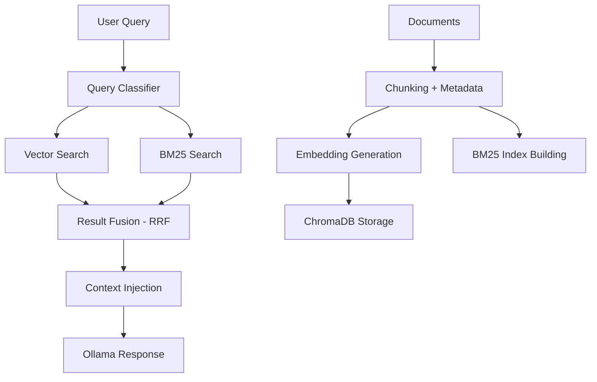

# Simple RAG for chat bot context / one source of truth.

- Ingest categorized knowledge files (PDFs, TXT, MD) to build a robust knowledge base.
- Hybrid Retrieval: Combines dense semantic vector search (SentenceTransformer) with sparse keyword search (BM25).
- Dynamic Rank Fusion: Merges search results using Reciprocal Rank Fusion (RRF) and dynamic query classification weights.
- Observability: Includes a `/test/retrieval` debug endpoint returning classification details, standalone search logs, and term overlap metrics.

# Architecture



This RAG middleware handles document processing and hybrid retrieval in a highly optimized loop:

### 1. Ingestion Pipeline
1. **Dynamic Chunking**: Chunks text based on structural headings (`detect_heading`) and tracks positions (`first`, `middle`, `last`). Sets chunk size dynamically based on file type (e.g. smaller chunks for text/documentation, larger for source files/code).
2. **Dense Vector Store**: Embeds chunks using `SentenceTransformer('all-MiniLM-L6-v2')` and stores vectors along with rich metadata (`heading`, `position`, `source`) in ChromaDB.
3. **BM25 Search Indexing**: Populates the local `BM25Okapi` index synchronously with all document texts stored in the database.

### 2. Hybrid Retrieval Pipeline
1. **Query Classification**: The user query is classified to determine retrieval weights:
   - `exact_identifier` (error codes / versions) -> `vector_weight = 0.2`, `bm25_weight = 1.0`
   - `short_keyword` (<= 3 words) -> `vector_weight = 0.5`, `bm25_weight = 1.0`
   - `natural_language` (questions or > 6 words) -> `vector_weight = 1.0`, `bm25_weight = 0.2`
   - `default` -> `vector_weight = 1.0`, `bm25_weight = 1.0`
2. **Parallel Retrieval**: Executes vector distance search and BM25 score lookup in parallel.
3. **Reciprocal Rank Fusion (RRF)**: Fuses both rank lists into a single consolidated result set using their rank positions and classification weights.
4. **Context Injection**: Prepares the top-K chunks, computes word overlaps (excluding common stop words), and passes them to Ollama inside function-calling messages.

# Installation

```bash
sudo apt-get update
sudo apt-get install zstd -y
sudo apt-get install curl wget ca-certificates -y
curl -fsSL https://ollama.com/install.sh | sh

# check version
ollama --version

# check status
sudo systemctl status ollama

# another check via curl
curl http://localhost:11434/api/tags

# download model (gemma3 4b) but up to you lol. NO THIS IS DOG SHIT USE qwen2.5:7b-instruct-q4_K_M it has function calling!
ollama pull qwen2.5:7b-instruct-q4_K_M

# model list
ollama list

# Test it!
ollama run gqwen2.5:7b-instruct-q4_K_M "Hello! What is your name and what can you help me with?"

# Congrats you have a low profile model running on CPU on almost 3gb ram? slow though but good trade!
```

## Quick start

```bash
# 1. Build & start
docker compose up --build -d

# 2. Check it's healthy
curl http://localhost:8330/health

# 3. Ingest your documents
curl -X POST 'http://localhost:8330/ingest' \
  --form 'files=@/D:/CLIENT FOR ASP/control-panel/documentation/faq.txt'

# 4. curl check the actual conversation
curl -X POST http://localhost:8330/v1/chat/completions \
  -H "Content-Type: application/json" \
  -H "Authorization: Bearer dummy" \
  -d '{
    "messages": [{"role": "user", "content": "How to upload?"}],
    "stream": false
  }'

# Optional: curl check query response (benchmark)
curl -X POST http://localhost:8330/test/retrieval \
  -H "Content-Type: application/json" \
  -d '{"query": "How do I upload a PDF file?"}'
```

## API endpoints

| Method | Path | Description |
|--------|------|-------------|
| GET | `/health` | Status + doc count |
| POST | `/ingest` | Upload files (PDF, TXT, MD) |
| DELETE | `/ingest` | Wipe all indexed documents |
| POST | `/v1/chat/completions` | Chat with model (Uses RAG if possible) |
| GET | `/v1/models` | list of available model in ollama i guess |
| POST | `/test/retrieval` | Benchmark queries |

## Environment variables

| Variable | Default | Description |
|----------|---------|-------------|
| `OLLAMA_URL` | `http://host.docker.internal:11434` | Your OLLAMA address |
| `OLLAMA_MODEL` | `qwen2.5:7b-instruct-q4_K_M` | Model name |
| `EMBED_MODEL` | `all-MiniLM-L6-v2` | Sentence transformer model |
| `TOP_K` | `6` | Chunks to retrieve per query |
| `CHUNK_SIZE` | `250` | Words per chunk |
| `CHUNK_OVERLAP` | `50` | Overlap between chunks |

## Logs

```bash
docker logs rag-middleware -f
```

## Stop / wipe

```bash
docker compose down          # stop, keep vector data
docker compose down -v       # stop AND delete all indexed docs
```

## Possible Issues

1. If you run this via docker and run the model locally you might have issue on firewall
```bash
sudo ufw status
Status: active

To                         Action      From
--                         ------      ----
22/tcp                     ALLOW       Anywhere
27017/tcp                  ALLOW       Anywhere
11434                      ALLOW       172.24.0.0/16 <--- Add this IP. this is my docker bridge ip
22/tcp (v6)                ALLOW       Anywhere (v6)
27017/tcp (v6)             ALLOW       Anywhere (v6)

sudo ufw allow from <CHANGE TO YOUR DOCKER BRIDGE IP> to any port 11434

# then test it

curl -X POST http://localhost:8330/v1/chat/completions \
  -H "Content-Type: application/json" \
  -d '{"messages": [{"role": "user", "content": "Hello!"}], "stream": false}'

```

